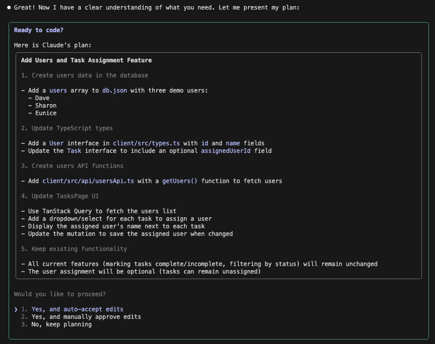
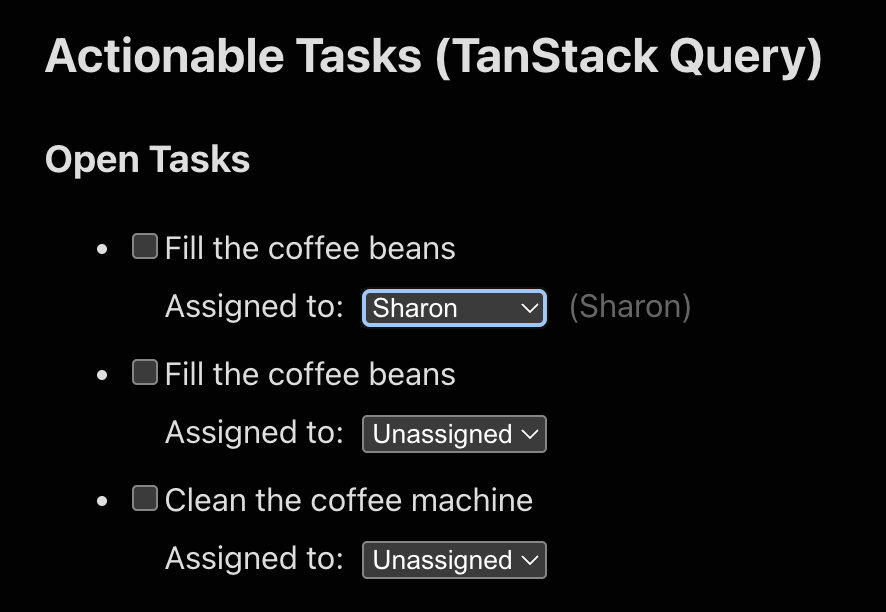

# workshop-ai-coding-oct-2025

This is a demo app for "ProtectionSociety", a fictional Checklist app that is very successful, but has a legacy codebase that AI coding assistants often struggle to deal with.

In this workshop we aim to:

- Demonstrate how to best use Planning mode
- How to effectively manage your context
- What can we do with Claude skills

## Getting started

```bash
git clone https://github.com/mikkel-sc/workshop-ai-coding-oct-2025.git
cd workshop-ai-coding-oct-2025/ProtectionSociety
npm install && npm start
```

You should now be up and running, and can see the app running here:

```text
http://localhost:5173/
```

## Part 1: Planning mode

The planning mode will help you understand what the model is goiong to do, before it does it - this is hugely useful to get predictable results, and make sure you are steering the LLM in the right direction.

> NOTE: make sure to set your Claude model to `haiku` - (do "/model" and choose the "haiku" option) - this is a smaller model that will consistently allow us to demonstrate the concepts we discuss in this workshop, also press `shift+tab` till you see "Accept edits on" underneath the input for now.

### Practical exmple

There is a bug in the analytics page ("/analytics") where we are not showing the cleanliness score - first we are going to try and fix it with this simple prompt:

```text
There is a bug whereby we are not showing the cleanliness score in the @AnalyticsPage, please fix.
```

Paste that in Claude and submit it. Once the fix is done, you'll see that the AI has added the missing column in the Results table, yay!


Now undo the changes we just made, clear your context (do `/clear` in Claude), and we'll try again, with planning mode enabled.
With the Claude Code terminal focused, press `shift+tab` till you see "Plan mode on" underneath the input.

Now paste the same prompt and press enter:

```text
There is a bug whereby we are not showing the cleanliness score in the @AnalyticsPage, please fix.
```

You'll notice that you are now presented with an outline of a plan!


You can simply auto-accept the changes, or manually accept, or plan some more.
Lets try the "manually approve" version - here you'll be presented with every change, and can accept it, or change it as you go:


See if you can make it use the heading "Clean" instead of "Cleanliness".
Accept the rest of the changes.

And now undo your changes again, (and clear your context `/clear` in Claude), because there's a problem! The analytics page is using a fetch call, but our standard is to use Tanstack Query - this is legacy code and must be fixed!

## Part 2: Context

Context helps the AI get a fuller picture of what we want it to do - it is especially important to realise that the context is limited in size - that is, it can only "remember" as much as the context can hold - which means it is important to only tell it things it needs to do when it needs to know.

### Practical exmple

Next we are going to allow the AI to read the documentation on how we like to do things around here, and make sure this is in our context - this will tell it what we need it to do about the lack of Tanstack query!

Paste this prompt:

```text
There is a bug whereby we are not showing the cleanliness score in the @AnalyticsPage, please fix. @ProtectionSociety/docs/frontend-best-practice.md
```

You'll notice that we are referencing the best practice documentation now, and that the result is quite different!


So what happend is this:

- Our prompt was almost the same as before
- We simply added a reference to the documentation
- The AI read the documentation, and made it part of the context
- This made the AI understand it needed to also use Tanstack query!

This is fantastic, because it means we are able to get the AI to do things without explicitly tellihng it every time - we can build on the documenattion over time and get improved results!

And now undo your changes again, (and clear your context `/clear` in Claude), because we are going to take this to the next level!

## Part 3: Sub agents

Let's create a sub-agent that is good at frontend and following the best practice:

```text
/agents
```

- Create new agent
- Generate with Claude
- Choose `Project (.claude/agents/)` for the location

Paste:

```text
This sub-agent should read the @ProtectionSociety/docs/frontend-best-practice.md document, and adhere to the best practices and fix any problems that the user might have.
```

- Allow all tools
- Inherit from parent
- Green (or whatever colour you please)
- ESC

> Note: if you're unable to get the agent to work, there's one in `/part3/frontend-best-practices-enforcer.md` that you can copy into `.claude/agents` - just remember to exit claude and go back in, for it to see the agent.

Now let's use it!

```text
Use the @agent-frontend-best-practices-enforcer to find the bug whereby we are not showing the cleanliness score in the @AnalyticsPage.tsx, and then please fix.
```

It will now have fixed the things!


You should have a look at the `ProtectionSociety/docs/frontend-best-practice.md` file to see what is in there, and also look at the sub-agent we just generated, to get a good understanding of how it works.

Next let's create a sub-agent that can help with users - follow the same patterns as above, starting with `/agents` to create one from this description (make it Yellow):

```test
We need an agent that can help us create and maintain users and related data in our system - it needs to understand how users work, and how we store them. We want to keep counts of things inside the users table, and if there are references between entities, they should be stored in tables named "users_ENTITY", with the userId and the ENTITYID in the table.
```

> Note: if you're unable to get the agent to work, there's one in `/part3/user-data-architect.md` that you can copy into `.claude/agents` - just remember to exit claude and go back in, for it to see the agent.

Then use it to create some users - start by using `plan` mode (shift-tab till plan mode is activated) and enter this:

```text
Let's add users to the system - as this is a workshop, we should create 3 demo users:\
  * Dave\
  * Sharon\
  * Eunice\
  We want to be able to assign a user to a task on the /tasks page
```

You'll get a plan somewhat like this:



Once you get your plan, accept all edits and let it create the solution - you should get a tasks page like so:



Go to [http://localhost:5173/tasks](http://localhost:5173/tasks) and assign a user to one or more tasks - you can now look at `ProtectionSociety/db.json`, and you should see the data including assigned users.

This concludes part 3, well done!

## Part 4: Claude Skills

Skills are reusable AI capabilities that Claude automatically invokes when relevant. Instead of explaining patterns repeatedly, you package expertise into skill files that Claude discovers and uses. Besides, skills can include executable scripts agent can invoke for more predictable results.

### The Problem: Inconsistent Data Structure

Examine `ProtectionSociety/db.json`. Notice the ID formats:

- Simple numbers: `"1"`, `"2"`, `"3"`
- Hexadecimal: `"200b"`, `"672d"`, `"f552"`, `"eed1"`

Let's say we want UUIDs for scalability. More importantly, we'll have future migrations (renaming fields, restructuring tables). Writing migration scripts manually is tedious and error-prone when maintaining referential integrity.

### The Solution: Migration Script Creator Skill

This repository includes a pre-created `data-migration` skill that generates safe, transactional migration scripts for db.json transformations. The skill:

- Analyzes database structure and detects foreign key relationships
- Plans migration phases in dependency order (parent tables before children)
- Generates Node.js scripts with ID mapping, validation, and rollback
- Includes a schema analyzer tool (`.claude/skills/data-migration/scripts/analyze-schema.js`)
- Maintains referential integrity throughout the migration

Claude will automatically invoke this skill when you describe database migrations.

#### Using the Skill

Open a new Claude Code instance, then give Claude Code this prompt:

```text
Create a migration script to convert all IDs in @ProtectionSociety/db.json to UUIDs while maintaining referential integrity.
```

Claude Code _should_:

1. Automatically invoke the `data-migration` skill, which will
   1. You'll see `> The "data-migration" skill is running` if that happens
2. Invoke the `analyze-schema.js` to analyse the `db.json` structure
3. Detect that tasks references users and checklist
4. Generate a transactional migration script with phases
5. Include validation and rollback instructions

In case it doesn't, you can explicitly ask it to use the skill:

```text
Use the data-migration skill to create a migration script that converts all IDs in @ProtectionSociety/db.json to UUIDs while maintaining referential integrity.
```

Now, run the generated migration script or ask Claude Code to do it. After running, you should see that all IDs in `db.json` are now UUIDs and all references are intact.

### Exploring the Skill Structure

Now that you've seen the skill in action, let's explore how it works:

```
.claude/skills/data-migration/
├── SKILL.md              # Main skill definition
└── scripts/
    └── analyze-schema.js # Schema analysis utility
```

**Key components of SKILL.md:**

- **YAML frontmatter**: The `description` field contains trigger keywords (migrate, convert IDs, UUIDs, db.json) that help Claude decide when to invoke this skill automatically
- **Core principles**: Fundamental rules for safe migrations (analyze dependencies, plan phases, maintain integrity, etc.)
- **Schema analyzer reference**: The skill instructs Claude to use `analyze-schema.js` for deterministic database structure analysis. In real world this could fetch the database schema.
- **Template structure**: Provides a complete migration script pattern with phases, validation, and rollback
- **Conciseness**: Kept under 500 lines using progressive disclosure principles

**The scripts/ directory:**

The `analyze-schema.js` script provides deterministic, verifiable analysis of db.json structure. By bundling executable scripts with skills, you make Claude's behavior more predictable and reliable for complex operations.

### Creating Your Own Skill

Now that you've used the data-migration skill, you might want to create custom skills for your own workflows. Anthropic provides a [skill-creator](https://github.com/anthropics/skills/tree/main/skill-creator) skill - a meta-skill that helps Claude guide you through building new skills!

**Key steps to create effective skills:**

1. **Identify the workflow**: Look for repetitive tasks where you find yourself explaining the same patterns to Claude repeatedly
2. **Use the skill-creator skill**: Ask Claude to help you build a skill, and it will guide you through the process using best practices
3. **Write a clear description**: Include both what the skill does AND when Claude should use it, with specific trigger keywords
4. **Keep it concise**: Aim for under 500 lines in SKILL.md, using progressive disclosure for detailed content
5. **Bundle executable scripts**: For deterministic operations (like schema analysis, validation, formatting), provide scripts rather than instructions
6. **Test across models**: Verify your skill works well with Haiku, Sonnet, and Opus

**Example skill ideas:**

- Code review checklists specific to your team's standards
- API integration patterns for your commonly-used services
- Testing strategy templates for different project types
- Documentation generation following your style guides

Skills committed to `.claude/skills/` in your repository are automatically shared with your team!

**Further Reading:**

- [Agent Skills Documentation](https://docs.claude.com/en/docs/claude-code/skills) - Official guide to creating and using skills
- [Skill Authoring Best Practices](https://docs.claude.com/en/docs/agents-and-tools/agent-skills/best-practices) - Guidelines for effective skill design
- [Example Skills Repository](https://github.com/anthropics/skills) - Collection of community skills for reference
