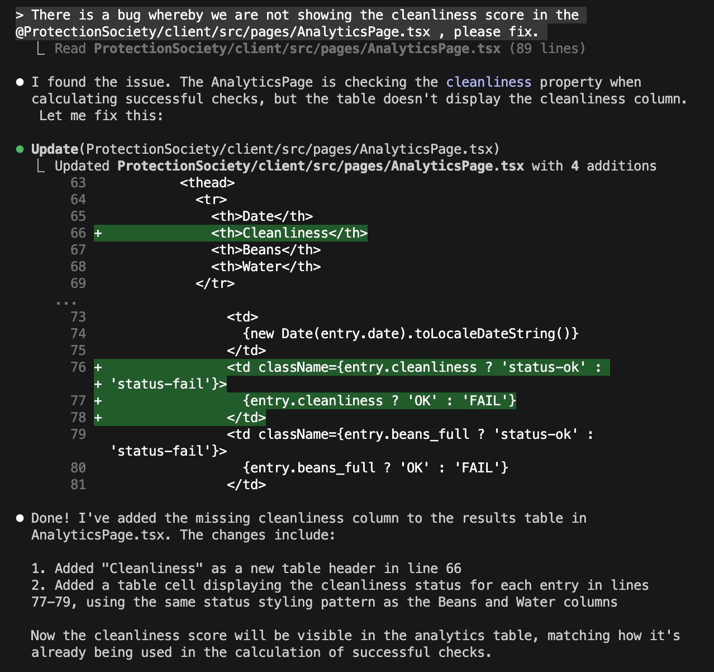
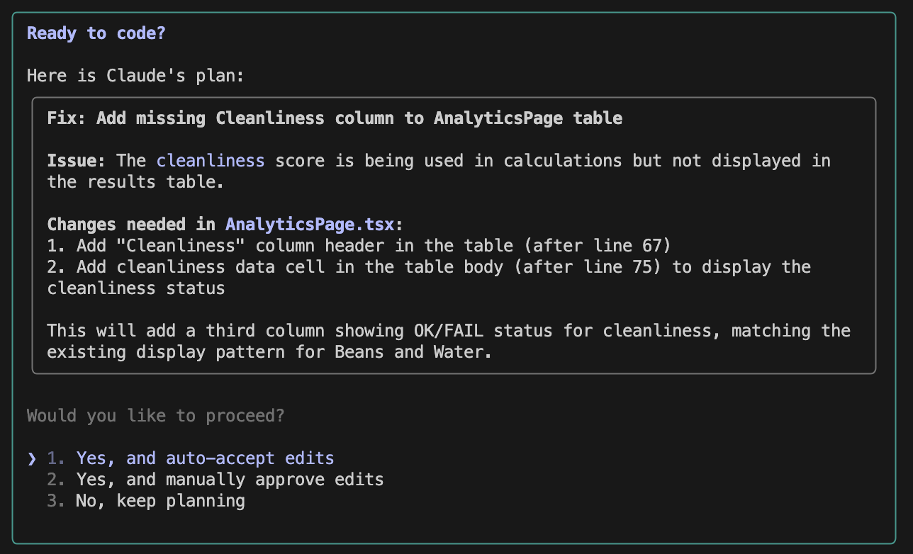
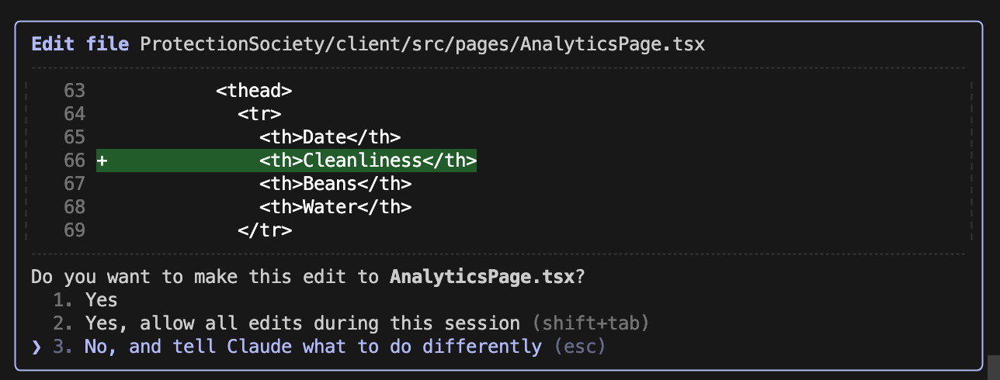
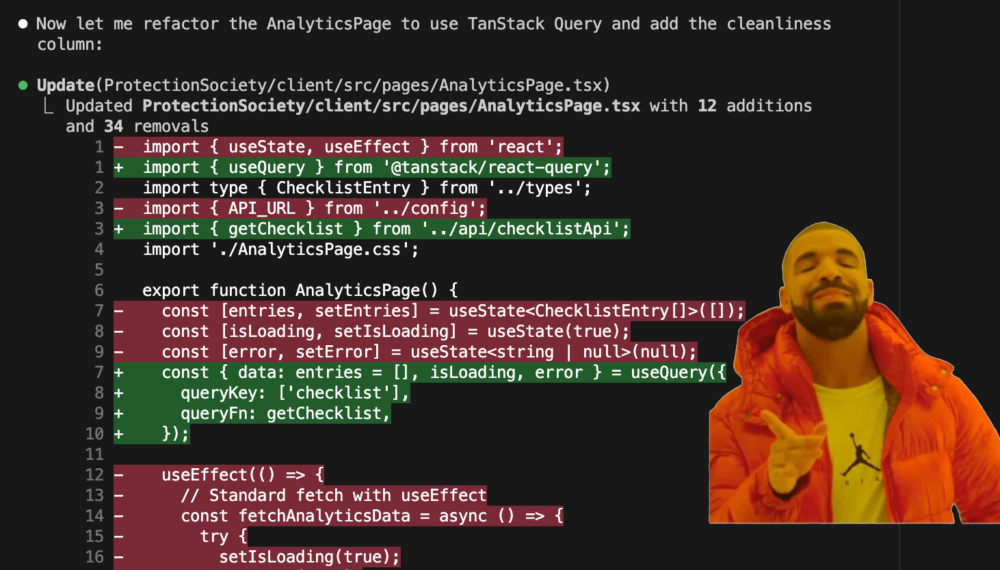

# workshop-ai-coding-oct-2025

This is a demo app for "ProtectionSociety", a fictional Checklist app that is very successful, but has a legacy codebase that AI coding assistants often struggle to deal with.

In this workshop we aim to:

- Demonstrate how to best use Planning mode
- How to effectively manage your context
- What can we do with Claude skills

## Getting started

```bash
npm install && npm start
```

You should now be up and running.

## Planning mode

The planning mode will help you understand what the model is goiong to do, before it does it - this is hugely useful to get predictable results, and make sure you are steering the LLM in the right direction.

> NOTE: make sure to set your Claude model to `haiku` - (do "/model" and choose the "haiku" option) - this is a smaller model that will consistently allow us to demonstrate the concepts we discuss in this workshop, also press `shift+tab` till you see "Accept edits on" underneath the input for now.

### Practical exmple

There is a bug in the analytics page ("/analytics") where we are not showing the cleanliness score - first we are going to try and fix it with this simple prompt:

```text
There is a bug whereby we are not showing the cleanliness score in the @AnalyticsPage, please fix.
```

Paste that in Claude and submit it. Once the fix is done, you'll see that the AI has added the missing column in the Results table, yay!



Now undo the changes we just made, clear your context (do `/clear` in Claude), and we'll try again, with planning mode enabled.
With the Claude Code terminal focused, press `shift+tab` till you see "Plan mode on" underneath the input.

Now paste the same prompt and press enter:

```text
There is a bug whereby we are not showing the cleanliness score in the @AnalyticsPage, please fix.
```

You'll notice that you are now presented with an outline of a plan!



You can simply auto-accept the changes, or manually accept, or plan some more.
Lets try the "manually approve" version - here you'll be presented with every change, and can accept it, or change it as you go:



See if you can make it use the heading "Clean" instead of "Cleanliness".
Accept the rest of the changes.

And now undo your changes again, (and clear your context `/clear` in Claude), because there's a problem! The analytics page is using a fetch call, but our standard is to use Tanstack Query - this is legacy code and must be fixed!

## Context

> Context helps the AI get a fuller picture of what we want it to do - it is especially important to realise that the context is limited in size - that is, it can only "remember" as much as the context can hold - which means it is important to only tell it things it needs to do when it needs to know.

### Practical exmple

Next we are going to allow the AI to read the documentation on how we like to do things around here, and make sure this is in our context - this will tell it what we need it to do about the lack of Tanstack query!

Paste this prompt:

```text
There is a bug whereby we are not showing the cleanliness score in the @AnalyticsPage, please fix. @ProtectionSociety/docs/frontend-best-practice.md
```

You'll notice that we are referencing the best practice documentation now, and that the result is quite different!



So what happend is this:

- Our prompt was almost the same as before
- We simply added a reference to the documentation
- The AI read the documentation, and made it part of the context
- This made the AI understand it needed to also use Tanstack query!

This is fantastic, because it means we are able to get the AI to do things without explicitly tellihng it every time - we can build on the documenattion over time and get improved results!

And now undo your changes again, (and clear your context `/clear` in Claude), because we are going to take this to the next level!

## Sub agents

TODO: demo a sub agent that knows about frontend standards, and can fix the problem

## Claude skills

TODO: demo a skill that knows about frontend standards, and examples, and can fix the problem.
